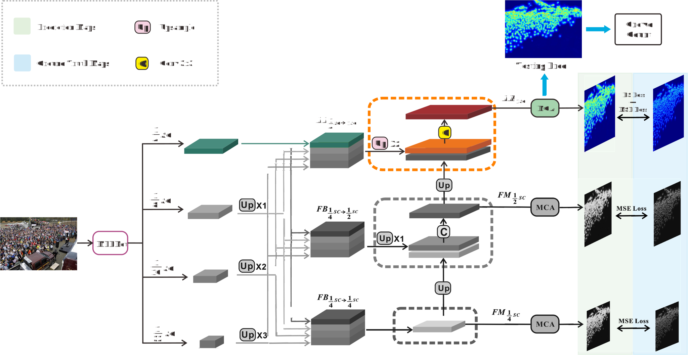
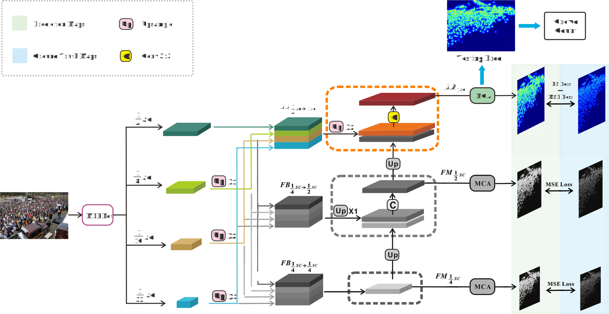
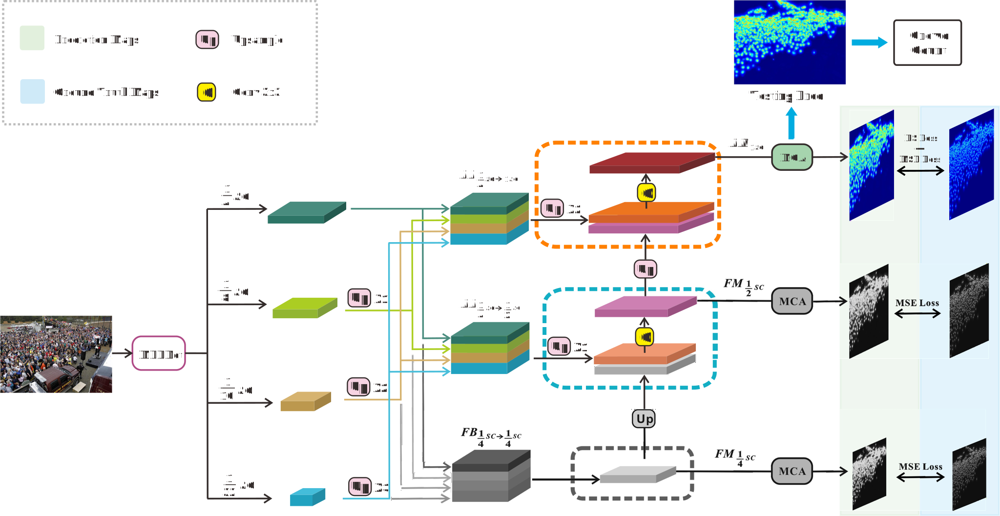
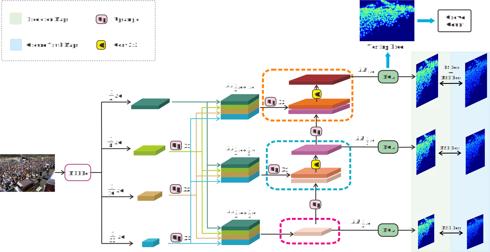

# MFFNet
https://yzueducn-my.sharepoint.com/:f:/g/personal/zhangxf_yzu_edu_cn/En3cINAQgXJFjvUIw8Qg7zUBWcmI9NwXW7VwsToAuLoLrg?e=nm6ete.

    
fig1

    
fig2

    
fig3

    
fig4

|      |                       |                                 |           Components            |                    |                    |         |      |           |           |    SHT B    |    ->    |      SHT A      |              |
| :--: | :-------------------: | :-----------------------------: | :-----------------------------: | :----------------: | :----------------: | :-----: | :--: | :-------: | :-------: | :---------: | :------: | :-------------: | :----------: |
|  SN  | $FB_{\frac{1}{4}->1}$ | $FB_{\frac{1}{4}->\frac{1}{2}}$ | $FB_{\frac{1}{4}->\frac{1}{4}}$ | $FM_{\frac{1}{2}}$ | $FM_{\frac{1}{4}}$ | MCA/CNN | Loss |    MAE    |    MSE    | Params (MB) | TCE (ep) | Train Time(min) | Test Time(s) |
|  1   |           √           |                ×                |                ×                |         ×          |         ×          |   MCA   | +BS  |   158.7   |   258.7   |    67.49    |   100    |      48.2       |      34      |
|  2   |           √           |                √                |                ×                |         ×          |         ×          |   MCA   | +BS  |   139.4   |   247.5   |    68.82    |   130    |      57.6       |      26      |
|  3   |           √           |                √                |                √                |         ×          |         ×          |   MCA   | +BS  |   139.9   |   235.0   |    68.86    |   320    |      137.6      |      27      |
|  4   |           √           |                √                |                √                |         √          |         ×          |   MCA   | +BS  |   127.9   |   209.4   |    68.86    |   110    |      49.5       |      26      |
|  5   |           √           |                √                |                √                |         √          |         √          |   CNN   | +BS  |   133.3   |   255.8   |    68.76    |   320    |      112.0      |      19      |
|  6   |           √           |                √                |                √                |         √          |         √          |   MCA   | MSE  |   130.3   |   216.0   |    68.86    |   800    |      640.0      |      45      |
|  7   |           √           |                √                |                √                |         √          |         √          |   MCA   | +BS  | **107.3** | **188.5** |    68.86    |   100    |      84.0       |      32      |
|  8   |                       |                                 |              FIDTM              |                    |                    |         |      |   147.6   |   282.2   |    66.58    |   670    |      335.0      |      21      |

<table class="tg">
<thead>
  <tr>
    <th class="tg-c3ow" rowspan="2">SN</th>
    <th class="tg-c3ow" colspan="7">Component</th>
    <th class="tg-c3ow" colspan="6">SHT B -&gt; SHT A</th>
  </tr>
  <tr>
    <th class="tg-c3ow">$FB_{\frac{1}{4}-&gt;1}$</th>
    <th class="tg-c3ow">$FB_{\frac{1}{4}-&gt;1}$</th>
    <th class="tg-c3ow">$FB_{\frac{1}{4}-&gt;\frac{1}{4}}$</th>
    <th class="tg-c3ow">$FM_{\frac{1}{2}}$</th>
    <th class="tg-c3ow">$FM_{\frac{1}{4}}$</th>
    <th class="tg-c3ow">MCA/CNN</th>
    <th class="tg-c3ow">Loss</th>
    <th class="tg-c3ow">MAE</th>
    <th class="tg-c3ow">MSE</th>
    <th class="tg-c3ow">Params (MB)</th>
    <th class="tg-c3ow">TCE (ep)</th>
    <th class="tg-c3ow">Train Time (min)</th>
    <th class="tg-c3ow">Test Time (s)</th>
  </tr>
</thead>
<tbody>
  <tr>
    <td class="tg-c3ow">1</td>
    <td class="tg-c3ow"></td>
    <td class="tg-c3ow"></td>
    <td class="tg-c3ow"></td>
    <td class="tg-c3ow"></td>
    <td class="tg-c3ow"></td>
    <td class="tg-c3ow">MCA</td>
    <td class="tg-c3ow">+BS</td>
    <td class="tg-c3ow">158.7</td>
    <td class="tg-c3ow">258.7</td>
    <td class="tg-c3ow">67.49</td>
    <td class="tg-c3ow">100</td>
    <td class="tg-c3ow">48.2</td>
    <td class="tg-c3ow">34</td>
  </tr>
  <tr>
    <td class="tg-c3ow">2</td>
    <td class="tg-c3ow"></td>
    <td class="tg-c3ow"></td>
    <td class="tg-c3ow"></td>
    <td class="tg-c3ow"></td>
    <td class="tg-c3ow"></td>
    <td class="tg-c3ow">MCA</td>
    <td class="tg-c3ow">+BS</td>
    <td class="tg-c3ow">139.4</td>
    <td class="tg-c3ow">247.5</td>
    <td class="tg-c3ow">68.82</td>
    <td class="tg-c3ow">130</td>
    <td class="tg-c3ow">57.6</td>
    <td class="tg-c3ow">26</td>
  </tr>
  <tr>
    <td class="tg-c3ow">3</td>
    <td class="tg-c3ow"></td>
    <td class="tg-c3ow"></td>
    <td class="tg-c3ow"></td>
    <td class="tg-c3ow"></td>
    <td class="tg-c3ow"></td>
    <td class="tg-c3ow">MCA</td>
    <td class="tg-c3ow">+BS</td>
    <td class="tg-c3ow">139.9</td>
    <td class="tg-c3ow">235.0</td>
    <td class="tg-c3ow">68.86</td>
    <td class="tg-c3ow">320</td>
    <td class="tg-c3ow">137.6</td>
    <td class="tg-c3ow">27</td>
  </tr>
  <tr>
    <td class="tg-c3ow">4</td>
    <td class="tg-c3ow"></td>
    <td class="tg-c3ow"></td>
    <td class="tg-c3ow"></td>
    <td class="tg-c3ow"></td>
    <td class="tg-c3ow"></td>
    <td class="tg-c3ow">MCA</td>
    <td class="tg-c3ow">+BS</td>
    <td class="tg-c3ow">127.9</td>
    <td class="tg-c3ow">209.4</td>
    <td class="tg-c3ow">68.86</td>
    <td class="tg-c3ow">110</td>
    <td class="tg-c3ow">495</td>
    <td class="tg-c3ow">26</td>
  </tr>
  <tr>
    <td class="tg-c3ow">5</td>
    <td class="tg-7btt"></td>
    <td class="tg-7btt"></td>
    <td class="tg-7btt"></td>
    <td class="tg-7btt"></td>
    <td class="tg-7btt"></td>
    <td class="tg-rvyq">CNN</td>
    <td class="tg-c3ow">+BS</td>
    <td class="tg-c3ow">133.3</td>
    <td class="tg-c3ow">255.8</td>
    <td class="tg-c3ow">68.76</td>
    <td class="tg-c3ow">320</td>
    <td class="tg-c3ow">112.0</td>
    <td class="tg-c3ow">19</td>
  </tr>
  <tr>
    <td class="tg-c3ow">6</td>
    <td class="tg-c3ow"></td>
    <td class="tg-c3ow"></td>
    <td class="tg-c3ow"></td>
    <td class="tg-c3ow"></td>
    <td class="tg-c3ow"></td>
    <td class="tg-c3ow">MCA</td>
    <td class="tg-c3ow">MSE</td>
    <td class="tg-c3ow">130.3</td>
    <td class="tg-c3ow">216.0</td>
    <td class="tg-c3ow">68.86</td>
    <td class="tg-c3ow">800</td>
    <td class="tg-c3ow">640.0</td>
    <td class="tg-c3ow">45</td>
  </tr>
  <tr>
    <td class="tg-c3ow">7</td>
    <td class="tg-c3ow"></td>
    <td class="tg-c3ow"></td>
    <td class="tg-c3ow"></td>
    <td class="tg-c3ow"></td>
    <td class="tg-c3ow"></td>
    <td class="tg-c3ow">MCA</td>
    <td class="tg-c3ow">+BS</td>
    <td class="tg-7btt">107.3</td>
    <td class="tg-7btt">188.5</td>
    <td class="tg-c3ow">68.86</td>
    <td class="tg-c3ow">100</td>
    <td class="tg-c3ow">84.0</td>
    <td class="tg-c3ow">32</td>
  </tr>
  <tr>
    <td class="tg-c3ow">8</td>
    <td class="tg-c3ow" colspan="7">FIDTM</td>
    <td class="tg-c3ow">147.6</td>
    <td class="tg-c3ow">282.2</td>
    <td class="tg-c3ow">66.58</td>
    <td class="tg-c3ow">670</td>
    <td class="tg-c3ow">335.0</td>
    <td class="tg-c3ow">21</td>
  </tr>
</tbody>
</table>
